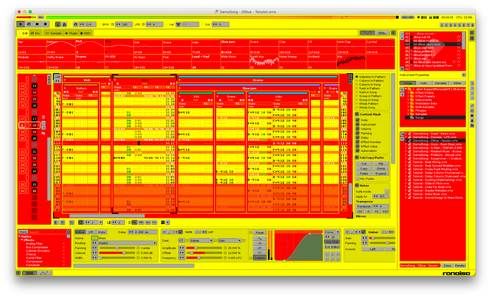

# Hotdog Stand theme for Renoise

Do you remember the ~~ridiculous~~ super-awesome [Hotdog Stand theme from Windows 3.1][atwood] and want it back?

Have you ever wanted to compose some sick tracks while your eyes go insane?

Well... no need to worry anymore!  This theme makes your Renoise looking like it's ready to sell some hot dogs:

## Installation

Clone the git repo and double click on the `Hotdog_Stand.xrnc` file to open it with Renoise.

## License

Unlicense.  Basically do whatever you want with it.

[atwood]: https://blog.codinghorror.com/a-tribute-to-the-windows-31-hot-dog-stand-color-scheme/
